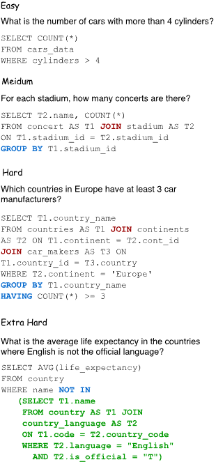

# Task 1:

* Decoder-only LLMs
    Qwen3-8b
    GPT-OSS-20b

* Reasoning LLMs
    DeepSeek-R1-Distill-Qwen-7B	

RQ1: How do (selected) LLms perform on cross-domain Text-to-SQL?

## Methodology:

In this report we evaluate the performance of decoder-only language models as well as reasoning LLMs on cross-domain SQL. Specifically, we evaluate the performance of decoder-only LLMs Qwen3-8B [needs citation] (non-MoE) and GPT-OSS-20B [needs citation] (3.6B active params MoE), as well as reasoning LLM Deepseek-R1-Distill-Qwen-14B (non-MoE) by downloading the checkpoints from Huggingface and running the models locally on 1x NVIDIA GeForce RTX 4090 GPU, without any quantization.

[For now, unless GPU hours prove otherwise] We use all ~1000 samples provided in the evaluation data under the Spider dataset [citation needed]. Given an example, we prompt the LLM:
```
Given the following SQLite database schema, write a SQL query that answers
the question.

{schema}

Question: {question}

Respond with only the SQL query in a ```sql code block.
```

For example, one of the schemas used is::
```
CREATE TABLE "stadium" (
  "Stadium_ID" NUMERIC, "Location" TEXT, "Name" TEXT, "Capacity" NUMERIC,
  "Highest" NUMERIC, "Lowest" NUMERIC, "Average" NUMERIC,
  PRIMARY KEY ("Stadium_ID")
)

CREATE TABLE "singer" (
  "Singer_ID" NUMERIC, "Name" TEXT, "Country" TEXT, "Song_Name" TEXT,
  "Song_release_year" TEXT, "Age" NUMERIC, "Is_male" TEXT,
  PRIMARY KEY ("Singer_ID")
)

CREATE TABLE "concert" (
  "concert_ID" NUMERIC, "concert_Name" TEXT, "Theme" TEXT, "Stadium_ID" TEXT, "Year" TEXT,
  PRIMARY KEY ("concert_ID"),
  FOREIGN KEY ("Stadium_ID") REFERENCES "stadium"("Stadium_ID")
)

CREATE TABLE "singer_in_concert" (
  "concert_ID" NUMERIC, "Singer_ID" TEXT,
  PRIMARY KEY ("concert_ID"),
  FOREIGN KEY ("concert_ID") REFERENCES "concert"("concert_ID"),
  FOREIGN KEY ("Singer_ID") REFERENCES "singer"("Singer_ID")
)
```

we could ask the question:
```
How many singers do we have?
```

to form a prompt like:

```
Given the following SQLite database schema, write a SQL query that answers
the question.

CREATE TABLE "stadium" (
  "Stadium_ID" NUMERIC, "Location" TEXT, "Name" TEXT, "Capacity" NUMERIC,
  "Highest" NUMERIC, "Lowest" NUMERIC, "Average" NUMERIC,
  PRIMARY KEY ("Stadium_ID")
)

CREATE TABLE "singer" (
  "Singer_ID" NUMERIC, "Name" TEXT, "Country" TEXT, "Song_Name" TEXT,
  "Song_release_year" TEXT, "Age" NUMERIC, "Is_male" TEXT,
  PRIMARY KEY ("Singer_ID")
)

CREATE TABLE "concert" (
  "concert_ID" NUMERIC, "concert_Name" TEXT, "Theme" TEXT, "Stadium_ID" TEXT, "Year" TEXT,
  PRIMARY KEY ("concert_ID"),
  FOREIGN KEY ("Stadium_ID") REFERENCES "stadium"("Stadium_ID")
)

CREATE TABLE "singer_in_concert" (
  "concert_ID" NUMERIC, "Singer_ID" TEXT,
  PRIMARY KEY ("concert_ID"),
  FOREIGN KEY ("concert_ID") REFERENCES "concert"("concert_ID"),
  FOREIGN KEY ("Singer_ID") REFERENCES "singer"("Singer_ID")
)

Question: How many singers do we have?

Respond with only the SQL query in a ```sql code block.
```

For each sample, the model may generate up to 2048 tokens to respond. We decode these tokens into text using the model-specific tokenizer, and check for the presence of a `</think>` token. If `</think>` was generated, we take all text generated before `</think>` as the reasoning trace and all text to the right as the output SQL. 

During decode, each model is run with greedy decoding so that we can get consistent results between runs. Models may generate up to 2048 tokens in the response, including reasoning traces. 

We evaluate the output using the same metrics as the Spider paper [citation needed]. These are:

1. Component Matching
    * For each of the following components:
        * SELECT
        * WHERE
        * GROUP BY
        * ORDER BY
        * KEYWORDS (including all SQL keywords without column names and operators)
    * Decompose each component in the prediction and ground truth as bags of several sub-components and check whether or not these two sets of components match completely.
2. Exact Matching
    * We measure whether the generated query as a whole is equivalent to the last section
    * The generated query is correct only if all components are correct
3. Execution Accuracy
    * A list of gold values for each question is given
    * We measure how many gold values the generated query extracts when executed

If output is invalid or unparsable, then it may fail all 3 dimensions (component matching, exact matching, execution accuracy). This is reasonable as invalid/unparsable output cannot be applied to SQL and thus must be avoided and penalized heavily.

We also consider the SQL Hardness Criteria, where queries are assigned difficulties based on the number of SQL components, selections, and conditions, so that queries that contain more SQL keywords are considered harder.


Figure [n]: SQL query examples in 4 hardness levels. Credit: Spider [citation needed]

## Results: