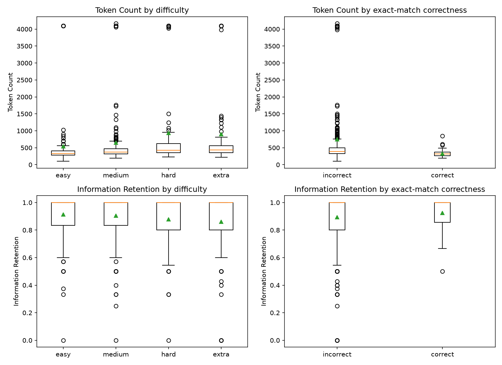

Run `python build_spider_dbs.py` before proceeding.

# Task 1 – RQ1: Methodology

RQ1: How do (selected) LLms perform on cross-domain Text-to-SQL?

In this report we evaluate the performance of decoder-only language models as well as reasoning LLMs on cross-domain SQL.

## 1.1 Experiment Design

We compare two decoder-only LLMs of different sizes from the same scale class against one reasoning LLM, so that the comparison isolates the effect of an explicit reasoning trace from raw parameter count as much as a 3-model study can. All three are accessed as local inference over their bf16 Huggingface checkpoints on 1x NVIDIA GeForce RTX 4090 GPU (no API-based models), so that inference parameters are fully under our control (see 1.5). We evaluate using batch sizes of 128 to maximize GPU utilization.

| Model | Category | Parameters | Quantization | Access | Thinking mode |
|---|---|---|---|---|---|
| Qwen3-0.6B [2] | Decoder-only | 0.6B | bf16 (none beyond release precision) | Local, Huggingface checkpoint | Disabled |
| OLMo-2-0425-1B-Instruct [3] | Decoder-only | 1B | bf16 (none beyond release precision) | Local, Huggingface checkpoint | N/A (no thinking mode) |
| DeepSeek-R1-Distill-Qwen-1.5B [4] | Reasoning | 1.5B | bf16 (none beyond release precision) | Local, Huggingface checkpoint | Always on (no disable option) |

All three are dense (non-MoE) models, so no distinction between total and active parameters applies.

## 1.2 Evaluation Dataset

We use all 1034 examples in the Spider [1] development split, with no subsampling and therefore no sampling seed to report; every example is included, so the per-database counts below and the per-database results tables (5 and 6) enumerate exactly which examples are used. To evaluate cross-domain performance, we additionally report results separately for each of the 20 databases in the Spider dev set: world_1 (120 problems), car_1 (92), cre_Doc_Template_Mgt (84), dog_kennels (82), flight_2 (80), student_transcripts_tracking (78), wta_1 (62), tvshow (62), network_1 (56), concert_singer (45), pets_1 (42), poker_player (40), orchestra (40), employee_hire_evaluation (38), course_teach (30), singer (30), museum_visit (18), battle_death (16), voter_1 (15), and real_estate_properties (4).

We also use the Spider Hardness Criteria, where queries are assigned difficulties based on the number of SQL components, selections, and conditions, so that queries that contain more SQL keywords are considered harder.


Figure 1: SQL query examples in 4 hardness levels. Credit: Spider [1]

## 1.3 Prompting and Input Representation

Each model receives three pieces of information in a single zero-shot user turn: a system instruction explaining its role as a Text-to-SQL generator, the database schema (table names, column names, primary keys, and foreign-key relationships, with no example rows), and the natural-language question. No few-shot examples are provided, so that the experiment measures each model's ability to generate SQL from instructions and schema information alone, without the confound of examples steering its output style. The prompt template is identical across all three models, so that differences in performance can be attributed to the models rather than to differences in prompting.

**Prompt template:**
```
Given the following SQLite database schema, write a SQL query that answers
the question.

{schema}

Question: {question}

Respond with only the SQL query in a ```sql code block.
```

See Appendix 1 for a worked example: a full schema, a question, and the resulting filled prompt.

## 1.4 SQL Extraction

For each sample, we decode the model's generated tokens into text using the model-specific tokenizer, and check for the presence of a `</think>` token. If `</think>` was generated, we take all text generated before `</think>` as the reasoning trace and all text to the right as the output SQL; DeepSeek-R1-Distill-Qwen-1.5B is the only model of the three that can emit this token. The SQL is then extracted from the first ```` ```sql ```` code block in that remaining text. The extracted SQL is passed to the evaluation script as-is. Outputs that cannot be extracted or parsed are counted as incorrect on every metric rather than excluded from the evaluation, since an unusable output is a real failure of the task, not missing data (see 1.6 and 2.4).

## 1.5 Inference Settings

All models are evaluated using the same decoding configuration: greedy decoding (`do_sample=False`, so temperature and top-p are not applied) for consistent, reproducible results between runs. The maximum output length differs by model: 256 tokens for Qwen3-0.6B and OLMo-2-0425-1B-Instruct, and 4096 tokens for DeepSeek-R1-Distill-Qwen-1.5B, since the latter's output also has to contain a full reasoning trace rather than only the SQL query. Reasoning is disabled wherever a model exposes the option: Qwen3-0.6B is run with thinking mode off; OLMo-2-0425-1B-Instruct has no thinking mode; DeepSeek-R1-Distill-Qwen-1.5B always produces a reasoning trace and has no documented way to disable it, which is why it is evaluated as the reasoning-LLM condition rather than given the same off-switch as Qwen3-0.6B. All inference runs on the same 1x RTX 4090 GPU described in 1.1, with batch size 128.

## 1.6 Evaluation Metrics

We evaluate the output using the same metrics as the Spider paper [1]. These are:

1. Component Matching
    * For each of the following components:
        * SELECT
        * WHERE
        * GROUP BY
        * ORDER BY
        * KEYWORDS (including all SQL keywords without column names and operators)
    * Decompose each component in the prediction and ground truth as bags of several sub-components and check whether or not these two sets of components match completely.
    * Checks accuracy, recall, and F1
2. Exact Matching Accuracy
    * We measure whether the generated query as a whole is equivalent to the last section
    * The generated query is correct only if all components are correct
    * Checks only accuracy
3. Execution Accuracy
    * A list of gold values for each question is given
    * We measure how many gold values the generated query extracts when executed
    * Checks only accuracy

If output is invalid or unparsable, then it fails all 3 dimensions (component matching, exact matching, execution accuracy), consistent with how 1.4 extracts and passes SQL to this evaluation script. This is reasonable as invalid/unparsable output cannot be applied to SQL and thus must be avoided and penalized heavily; Results 2.4 reports how often this happens for each model.

# Task 1 – RQ1: Results

## 2.1 Overall Model Performance

Below we report how Qwen3-0.6B, OLMo-2, and Deepseek-R1-Distill-Qwen3-1.5B perform on the Spider benchmark across all 3 metrics (Component Matching, Exact Matching Accuracy, Execution Accuracy). We calculate the values per problem difficulty as well as overall, and display them in the below tables.

All models are evaluated zero-shot with the same prompt on the 20 databases of the Spider dev set. Aggregated across all difficulties and databases, we find that every model performs poorly, with execution accuracy between 0.121 and 0.209 and exact matching accuracy between 0.085 and 0.123. Execution accuracy is higher than exact matching accuracy for all three models (for example 0.209 vs. 0.099 for Qwen3-0.6B), which suggests that at least some of the queries that return the correct result are written differently from the gold SQL (see 2.6 for more on this relationship). No single model is best across metrics, databases, and difficulty levels. Table 9 reports the efficiency side of this comparison: inference time per example.

Table 1: Overall performance summary, aggregated across all difficulties (all 1034 problems). Component matching is accuracy / recall / F1 (macro-averaged, see the note on table 2 in 2.6). Per-difficulty breakdowns are in tables 2-4.

| Model | Parameters | Category | Component matching | Exact matching | Execution accuracy |
|---|---|---|---|---|---|
| Qwen3-0.6B | 0.6B | Decoder-only | 0.628 / 0.209 / 0.314 | 0.099 | 0.209 |
| OLMo-2-0425-1B-Instruct | 1B | Decoder-only | 0.640 / 0.211 / 0.317 | 0.123 | 0.195 |
| DeepSeek-R1-Distill-Qwen-1.5B | 1.5B | Reasoning | 0.661 / 0.174 / 0.275 | 0.085 | 0.121 |

#### 2. Component matching (accuracy / recall / F1)

| Model | easy | medium | hard | extra | all |
|---|---|---|---|---|---|
| Problems (n) | 248 | 446 | 174 | 166 | 1034 |
| Qwen3-0.6B | 0.675 / 0.308 / 0.423 | 0.582 / 0.235 / 0.334 | 0.540 / 0.141 / 0.223 | 0.578 / 0.160 / 0.250 | 0.628 / 0.209 / 0.314 |
| OLMo-2-0425-1B-Instruct | 0.813 / 0.378 / 0.516 | 0.497 / 0.194 / 0.279 | 0.654 / 0.179 / 0.281 | 0.441 / 0.126 / 0.196 | 0.640 / 0.211 / 0.317 |
| DeepSeek-R1-Distill-Qwen-1.5B | 0.566 / 0.288 / 0.382 | 0.642 / 0.185 / 0.287 | 0.543 / 0.113 / 0.187 | 0.389 / 0.104 / 0.164 | 0.661 / 0.174 / 0.275 |

#### 3. Exact matching accuracy

| Model | easy | medium | hard | extra | all |
|---|---|---|---|---|---|
| Problems (n) | 248 | 446 | 174 | 166 | 1034 |
| Qwen3-0.6B | 0.157 | 0.137 | 0.006 | 0.006 | 0.099 |
| OLMo-2-0425-1B-Instruct | 0.379 | 0.061 | 0.034 | 0.000 | 0.123 |
| DeepSeek-R1-Distill-Qwen-1.5B | 0.214 | 0.078 | 0.000 | 0.000 | 0.085 |

#### 4. Execution accuracy

| Model | easy | medium | hard | extra | all |
|---|---|---|---|---|---|
| Problems (n) | 248 | 446 | 174 | 166 | 1034 |
| Qwen3-0.6B | 0.210 | 0.276 | 0.126 | 0.114 | 0.209 |
| OLMo-2-0425-1B-Instruct | 0.452 | 0.152 | 0.109 | 0.018 | 0.195 |
| DeepSeek-R1-Distill-Qwen-1.5B | 0.258 | 0.128 | 0.017 | 0.006 | 0.121 |

## 2.2 Performance by Query Difficulty

We break every metric down by the Spider Hardness Criteria (1.2) because query difficulty, not just model identity, is a first-order driver of Text-to-SQL performance; comparing models only in aggregate would hide whether a model's advantage holds up as queries get harder. Tables 2-4 above already report this breakdown in their "easy" through "extra" columns. Performance decreases with difficulty for every model: the decrease is largest on hard and extra problems, where exact matching accuracy is at most 0.034 and execution accuracy is at most 0.126, down from as high as 0.452 (OLMo, easy) and 0.379 (OLMo, easy exact match) on the easiest problems.

## 2.3 Performance by Database

#### 5. Execution accuracy by database (domain)

| Database | Problems (n) | Qwen3-0.6B | OLMo-2-0425-1B-Instruct | DeepSeek-R1-Distill-Qwen-1.5B |
|---|---|---|---|---|
| world_1 | 120 | 0.183 | 0.100 | 0.108 |
| car_1 | 92 | 0.109 | 0.207 | 0.054 |
| cre_Doc_Template_Mgt | 84 | 0.202 | 0.250 | 0.071 |
| dog_kennels | 82 | 0.159 | 0.098 | 0.085 |
| flight_2 | 80 | 0.263 | 0.300 | 0.250 |
| student_transcripts_tracking | 78 | 0.128 | 0.244 | 0.064 |
| wta_1 | 62 | 0.161 | 0.274 | 0.129 |
| tvshow | 62 | 0.339 | 0.226 | 0.129 |
| network_1 | 56 | 0.286 | 0.232 | 0.179 |
| concert_singer | 45 | 0.111 | 0.089 | 0.000 |
| pets_1 | 42 | 0.167 | 0.048 | 0.071 |
| poker_player | 40 | 0.250 | 0.175 | 0.225 |
| orchestra | 40 | 0.350 | 0.225 | 0.100 |
| employee_hire_evaluation | 38 | 0.105 | 0.158 | 0.132 |
| course_teach | 30 | 0.100 | 0.133 | 0.100 |
| singer | 30 | 0.533 | 0.367 | 0.267 |
| museum_visit | 18 | 0.278 | 0.278 | 0.222 |
| battle_death | 16 | 0.375 | 0.188 | 0.188 |
| voter_1 | 15 | 0.267 | 0.200 | 0.267 |
| real_estate_properties | 4 | 0.500 | 0.250 | 0.000 |

#### 6. Exact matching accuracy by database (domain)

| Database | Problems (n) | Qwen3-0.6B | OLMo-2-0425-1B-Instruct | DeepSeek-R1-Distill-Qwen-1.5B |
|---|---|---|---|---|
| world_1 | 120 | 0.067 | 0.050 | 0.025 |
| car_1 | 92 | 0.043 | 0.152 | 0.033 |
| cre_Doc_Template_Mgt | 84 | 0.071 | 0.143 | 0.071 |
| dog_kennels | 82 | 0.085 | 0.037 | 0.061 |
| flight_2 | 80 | 0.075 | 0.100 | 0.200 |
| student_transcripts_tracking | 78 | 0.090 | 0.128 | 0.064 |
| wta_1 | 62 | 0.065 | 0.226 | 0.129 |
| tvshow | 62 | 0.226 | 0.194 | 0.097 |
| network_1 | 56 | 0.125 | 0.214 | 0.179 |
| concert_singer | 45 | 0.022 | 0.022 | 0.000 |
| pets_1 | 42 | 0.000 | 0.048 | 0.024 |
| poker_player | 40 | 0.175 | 0.150 | 0.100 |
| orchestra | 40 | 0.225 | 0.125 | 0.100 |
| employee_hire_evaluation | 38 | 0.105 | 0.105 | 0.105 |
| course_teach | 30 | 0.033 | 0.100 | 0.067 |
| singer | 30 | 0.333 | 0.233 | 0.167 |
| museum_visit | 18 | 0.056 | 0.111 | 0.111 |
| battle_death | 16 | 0.250 | 0.125 | 0.062 |
| voter_1 | 15 | 0.133 | 0.200 | 0.200 |
| real_estate_properties | 4 | 0.000 | 0.250 | 0.000 |

Tables 5 and 6 report execution and exact matching accuracy on each of the 20 databases, all of which are unseen by the models. Execution accuracy ranges from 0.10 (course_teach) to 0.53 (singer) for Qwen3-0.6B, from 0.05 (pets_1) to 0.37 (singer) for OLMo-2-1B, and from 0.00 (concert_singer) to 0.27 (singer and voter_1) for DeepSeek-R1-Distill-Qwen-1.5B. The best model also differs by database: Qwen3-0.6B has the highest execution accuracy on 13 databases, OLMo-2-1B on 8, and DeepSeek-R1-Distill-Qwen-1.5B on 1 (ties are counted for each tied model). For example, OLMo-2-1B performs best on car_1 (0.21 vs. 0.11 and 0.05) and student_transcripts_tracking (0.24 vs. 0.13 and 0.06), while Qwen3-0.6B performs best on world_1, tvshow, and orchestra. DeepSeek-R1-Distill-Qwen-1.5B has the highest exact matching accuracy on flight_2 (0.20 vs. 0.07 and 0.10). Databases with few problems (real_estate_properties with n=4, voter_1 with n=15, battle_death with n=16, and museum_visit with n=18) are too small to rank the models reliably, since a single problem changes a score by 6 to 25 percentage points.

## 2.4 Invalid and Unparseable Outputs

We count how often each model's output cannot be used as SQL at all: it either never produces a usable query within the token budget (1.5) or is truncated before finishing one. Per 1.6, these count as failures on every metric rather than being excluded. This is a direct measure of how reliably each model follows the "respond with only a SQL query" instruction, independent of whether the SQL it does produce is correct.

Table 7: Invalid or unfinished outputs per model, out of 1034 generations each. An output is invalid if it is truncated at the model's max-output-length (1.5) or finishes without at least 3 words of usable text.

| Model | Invalid outputs | Invalid rate |
|---|---|---|
| Qwen3-0.6B | 23 | 2.2% |
| OLMo-2-0425-1B-Instruct | 9 | 0.9% |
| DeepSeek-R1-Distill-Qwen-1.5B | 100 | 9.7% |

DeepSeek's invalid rate is about 4-11x higher than the two non-reasoning models, despite having a 16x larger token budget (4096 vs. 256, see 1.5) to work with. 2.6 breaks this down further by difficulty and by why the generation failed (tables 10-13).

## 2.5 Average Generated Tokens and Inference Time

#### 8. Average generated tokens per question

| Model | easy | medium | hard | extra | all |
|---|---|---|---|---|---|
| Qwen3-0.6B | 27.5 | 44.7 | 53.7 | 69.9 | 46.1 |
| OLMo-2-0425-1B-Instruct | 57.2 | 89.9 | 97.8 | 111.4 | 86.9 |
| DeepSeek-R1-Distill-Qwen-1.5B | 610.8 | 768.4 | 1096.0 | 1176.9 | 851.3 |

#### 9. Inference time

Inference time is measured from the start of generation to the complete batch output, per batch of 128, excluding tokenization, model loading, and warm-up; the per-example figure amortizes each batch's wall time evenly across its 128 examples.

| Model | Total wall time (s) | Avg. time per example (s) |
|---|---|---|
| Qwen3-0.6B | 123.9 | 0.120 |
| OLMo-2-0425-1B-Instruct | 45.0 | 0.044 |
| DeepSeek-R1-Distill-Qwen-1.5B | 3059.8 | 2.959 |

DeepSeek is about 25x slower per example than Qwen3-0.6B and 68x slower than OLMo-2, consistent with its much higher average token count (table 8). Qwen3-0.6B is slower than OLMo-2 despite generating fewer tokens on average (46.1 vs. 86.9), which is not explained by token count alone; we do not have a confirmed cause and do not draw further conclusions from this comparison.

#### 10. DeepSeek-R1-Distill-Qwen-1.5B by generation outcome

Note that "Cut" means the generation reached the 4096-token limit. 

| Outcome | Problems (n) | Share | Avg. tokens | Exact match | Component F1 |
|---|---|---|---|---|---|
| Finished with SQL | 934 | 90.3% | 512 | 0.094 | 0.286 |
| Finished, no usable SQL | 2 | 0.2% | 284 | 0.000 | 0.100 |
| Cut while answering (after `</think>`) | 13 | 1.3% | 4096 | 0.000 | 0.096 |
| Cut while thinking (no `</think>`) | 85 | 8.2% | 4096 | 0.000 | 0.093 |
| All | 1034 | 100% | 851 | 0.085 | 0.275 |

#### 11. The same 934 questions that DeepSeek finished, for all three models

| Model | Exact match | Component F1 |
|---|---|---|
| DeepSeek-R1-Distill-Qwen-1.5B | 0.094 | 0.286 |
| Qwen3-0.6B | 0.103 | 0.317 |
| OLMo-2-0425-1B-Instruct | 0.131 | 0.324 |

#### 12. Are the cut-off DeepSeek generations repetition loops?

A text that repeats itself compresses well, so a low compression ratio of the last 3000 characters indicates a loop.

| Generations | n | Median compression ratio | Ratio < 0.15 | Last 150 characters repeat 3 or more times |
|---|---|---|---|---|
| Cut off | 98 | 0.095 | 95.9% | 96.9% |
| Finished | 936 | 0.418 | 0.0% | 0.2% |

#### 13. Share of DeepSeek generations that did not finish with SQL, by difficulty

| | easy | medium | hard | extra | all |
|---|---|---|---|---|---|
| Problems (n) | 248 | 446 | 174 | 166 | 1034 |
| Not finished with SQL (n) | 15 | 33 | 25 | 27 | 100 |
| Share | 6.0% | 7.4% | 14.4% | 16.3% | 9.7% |


## 2.6 Interpretation of Results

Difficulty and database effects are discussed in 2.2 and 2.3 above; this section covers model size, reasoning architecture, and the relationship between exact-match and execution accuracy.

### Effect of Model Size and Reasoning Architecture

Based on the above tables, the reasoning model did not perform well on this task. DeepSeek-R1-Distill-Qwen-1.5B (reasoning, 1.5B) is below the smaller non-reasoning models Qwen3-0.6B (thinking off) and OLMo-2-1B-Instruct on recall, F1, exact matching, and execution accuracy, and tables 10 to 13 show why:

* **Component matching (table 2):** aggregated across all difficulties, DeepSeek has the lowest recall (0.174 vs. 0.209 and 0.211) and F1 (0.275 vs. 0.314 and 0.317). Its recall is the lowest at every difficulty level, and its F1 is the lowest at every level except medium (0.287 vs. 0.279 for OLMo). It does have the highest accuracy (0.661 vs. 0.628 and 0.640), but accuracy only scores components that the model actually wrote, so this reflects that DeepSeek often writes none (table 10) and is more often right on the components it does write, and it does not compensate for the low recall. OLMo has the best F1 aggregated across all difficulties, and performs best on easy problems (0.813 / 0.378 / 0.516).
* **Exact matching (table 3):** aggregated across all difficulties, DeepSeek is lowest (0.085 vs. 0.099 for Qwen and 0.123 for OLMo), and it solves no hard or extra problems (0.000).
* **Execution accuracy (table 4):** aggregated across all difficulties, DeepSeek is clearly lowest (0.121 vs. 0.209 for Qwen and 0.195 for OLMo), and its accuracy falls to 0.017 on hard and 0.006 on extra problems.

**Why the reasoning model does poorly.** Three observations from tables 10 to 13 explain the result.

1. *It often fails to produce an answer.* 100 of 1034 generations (9.7%) end without usable SQL (table 10): 85 never leave the reasoning phase, 13 are cut while writing the answer, and 2 finish without SQL. All of them score 0 on exact matching. The share grows with difficulty, from 6.0% on easy to 16.3% on extra problems (table 13), which contributes to the collapse on hard and extra problems.
2. *The cut-off generations are loops, not long but productive reasoning.* The tails of 95.9% of cut-off generations are highly repetitive (compression ratio below 0.15, median 0.095), compared with none of the finished generations (median 0.418) (table 12). For example, the model rewrites the same query and says "So the final query is:" again and again without converging.
3. *Finishing does not make it better.* On the 934 questions where DeepSeek did finish with SQL, its exact matching accuracy (0.094) and component F1 (0.286) are still below those of Qwen (0.103 and 0.317) and OLMo (0.131 and 0.324) on the same questions (table 11), while it generated 512 tokens on average for these questions, compared with 46 for Qwen and 87 for OLMo averaged over all questions (tables 8 and 10). Even if the 100 unfinished generations were solved as often as the finished ones, DeepSeek's overall exact matching accuracy would only rise from 0.085 to about 0.094, which is still below OLMo (0.123) and slightly below Qwen (0.099). The unfinished questions are harder than average, so the true ceiling is lower.

So the reasoning trace mostly lengthens the output and sometimes never terminates, and it does not improve the SQL when it does terminate. Aggregated across all difficulties, DeepSeek generates 851 tokens per problem on average (table 8), compared to 87 for OLMo (about 10x) and 46 for Qwen (about 18x); the number of tokens it generates also increases with difficulty, from 611 on easy problems to 1177 on extra problems, whereas the non-reasoning models stay between 28 and 111 tokens on average. So the extra size of DeepSeek (1.5B vs. 0.6B and 1B) and its always-on reasoning trace buy more output, more latency (2.5), and a higher invalid-output rate (2.4), but not better SQL.

Between the two non-reasoning models, there is no clear winner either, so size alone does not explain the ranking: OLMo (1B) has the best exact matching accuracy aggregated across all difficulties (0.123) and performs best on easy problems for every metric (for example 0.452 vs. 0.210 execution accuracy for Qwen), while Qwen (0.6B, 40% fewer parameters) has the best execution accuracy aggregated across all difficulties (0.209) and on medium, hard, and extra problems (0.276, 0.126, and 0.114), where OLMo drops to 0.018 on extra problems. The exact matching advantage of OLMo is driven by easy problems. Taken together, model size is not a reliable predictor of Text-to-SQL performance in this experiment: the largest model (DeepSeek) is worst overall, and between the two smaller models, the larger one (OLMo) only wins on some metrics and difficulty levels.

### Relationship Between Exact-Match and Execution Accuracy

For all three models, execution accuracy aggregated across all difficulties exceeds exact matching accuracy (table 1): 0.209 vs. 0.099 for Qwen3-0.6B, 0.195 vs. 0.123 for OLMo-2-0425-1B-Instruct, and 0.121 vs. 0.085 for DeepSeek-R1-Distill-Qwen-1.5B. Since exact matching requires every SQL component to match the gold query while execution accuracy only requires the same result set, this gap indicates that each model writes some queries that are valid and correct but phrased differently from the gold SQL (for example, a different but equivalent join order, or an explicit column list where the gold query uses `SELECT *`). The gap is widest for Qwen3-0.6B (11.0 points) and narrowest for DeepSeek-R1-Distill-Qwen-1.5B (3.6 points); DeepSeek's narrower gap is consistent with it producing fewer alternative-but-valid queries, not with it being more exact, since its absolute accuracy on both metrics is the lowest of the three.

**Limitations.** Our working hypothesis is that Text-to-SQL at this scale does not benefit from an explicit reasoning trace, and that a non-reasoning model with 0.5B to 1B parameters is sufficient. The results are consistent with this hypothesis, but they do not establish that Text-to-SQL is too simple for reasoning models, because several confounds are not controlled:

* **Truncation and failed outputs for DeepSeek.** 98 of 1034 generations (9.5%) reach the 4096-token limit, and 87 DeepSeek predictions contain fewer than 3 words, i.e. effectively no SQL. These count as failures on every metric and lower DeepSeek's recall, exact matching, and execution scores. Table 11 shows that removing these cases would not change the ranking, since DeepSeek is also lower on the questions it finished, and table 12 shows that the cut-off generations are repetition loops, so a larger token budget is unlikely to rescue them. 
* **Model differences beyond reasoning.** The three models differ in size (0.6B, 1B, and 1.5B parameters) and in pretraining and post-training, not only in whether they reason. DeepSeek-R1-Distill-Qwen-1.5B is also a distilled model, so the effect of reasoning cannot be separated from the quality of distillation.
* **Single run and sample size.** We report one run with one seed and no confidence intervals. Differences of a few points (for example 0.099 vs. 0.123 exact matching accuracy for Qwen and OLMo, or 0.209 vs. 0.195 execution accuracy) may not be significant.
* **Aggregated component matching.** The component matching row in table 2 is our own macro-average, namely the mean of the 10 per-component accuracy and recall scores with F1 computed from these two means, and is not a number reported by Spider.

## 3. Answer to Research Question (RQ1)

RQ1: How do (selected) LLMs perform on cross-domain Text-to-SQL?

All three models perform poorly in this zero-shot setting, with exact matching accuracy between 0.085 and 0.123 and execution accuracy between 0.121 and 0.209 (table 1). Within that, the results point to three findings.

**First, model size does not reliably predict performance here, and more size combined with an always-on reasoning trace is actively worse.** DeepSeek-R1-Distill-Qwen-1.5B is the largest model (1.5B) and the only one that reasons, yet it is the lowest of the three on every aggregate metric except its own narrowly-defined component-matching accuracy (2.6). Among the two non-reasoning models, the larger one (OLMo, 1B) beats the smaller one (Qwen, 0.6B) on exact matching but loses to it on execution accuracy (2.6), so going from 0.6B to 1B parameters does not produce a consistent win either.

**Second, the reasoning architecture itself is the main driver of DeepSeek's low score, not its parameter count.** DeepSeek's invalid-output rate (9.7%) is 4-11x higher than the two non-reasoning models (2.4), driven by generations that never finish reasoning within the token budget and that are themselves repetition loops rather than productive deliberation (2.6, tables 10-13). Even on the 934 questions it does finish, DeepSeek still scores below Qwen and OLMo on the same questions (2.6), while taking 25-68x longer per example to do so (2.5). The reasoning trace adds cost without adding accuracy at this scale.

**Third, query difficulty has a substantial, consistent effect on every model.** Exact matching and execution accuracy both fall sharply from easy to extra-hard problems for all three models, down to at most 0.034 and 0.126 respectively on the hardest problems (2.2).

Overall, in this zero-shot, cross-domain setting, a non-reasoning decoder-only model in the 0.6-1B range performs at least as well as a 1.5B reasoning model while being an order of magnitude faster, and none of the three models solve more than a small fraction of hard or extra-hard queries. This answers RQ1 for the three models evaluated; it does not establish that reasoning cannot help Text-to-SQL in general, only that it did not help here, for the reasons given in the Limitations above.

# Task 2 – RQ2: Methodology

RQ2: How do characteristics of reasoning traces (of reasoning LLM) relate to Text-to-SQL performance?

To answer this question, we examine the Token Count and Information Retention for each model. In a reasoning trace, the Token Count measures the total number of tokens generated in the reasoning chain, and Information Retention measures how frequently facts that were not in the initial prompt nor logically derived from prior steps were introduced, i.e., how frequent hallucinations occur. 

We examine the Token Count of the reasoning trace as we believe it should scale positively with the difficulty of the related Text-to-SQL problem. Easy questions should require less thinking tokens, while extra-hard questions should require significantly more, and any that disobey this relation should be given special attention. We split each generation into a reasoning segment (everything before `</think>`) and an answer segment (the SQL, after `</think>`), the same split used in Task 1, and compute Token Count as the number of tokens in the reasoning segment only, re-tokenized with the model's own tokenizer (not the `new_tokens` field logged during generation, which counts the whole generation, reasoning plus SQL). We will test this using Spearman's Rank Correlation.

For generations that never emit `</think>` (truncated at the 4096-token generation limit, see Task 1 table 10), the entire generated text is treated as the reasoning segment, so Token Count for these rows is effectively capped at the generation limit rather than reflecting a completed thought. This is intentional: these cases are exactly the repetition loops Task 1 identified (table 12), and dropping them would hide, rather than explain, the heavy right tail in Token Count. We keep them in the Token Count analysis and flag wherever they drive a result (see finding 1 in Results).

We also examine Information Retention of the reasoning trace as we believe any reasoning traces that have low Information Retention, or high frequency of hallucinations, should result in lower-performing answers than those with higher Information Retention/lower frequency of hallucinations. Additionally, harder problems should not cause lower Information Retention. If this is the case, we must examine and analyze the assumptions and hallucinations introduced by the model to better understand its underlying biases. We compute it by regex-extracting every schema-shaped identifier the trace mentions (quoted, e.g. `"Singer_ID"`, or underscore-joined, e.g. `concert_id`) and taking the share of those identifiers that actually appear as a table or column name in that question's schema; an identifier that matches neither is treated as a fact the model introduced on its own rather than one grounded in the prompt, i.e., a hallucination. Traces that mention no schema identifiers at all are excluded from Information Retention (but kept for Token Count), since a 0-of-0 ratio is undefined rather than evidence of perfect or zero retention. Truncated traces are scored the same way, over whatever partial text was generated.

We relate both Token Count and Information Retention to correctness and difficulty with Spearman's Rank Correlation throughout. Both of our hypotheses are about monotonic relationships, not linear relationships (performance should not decrease as Token Count or Information Retention increase, and Token Count should increase with difficulty), which is exactly what Spearman's Rank Correlation tests for. It also suits the distribution of our two reasoning metrics: Token Count is a non-negative count with a long right tail (DeepSeek alone ranges from 611 tokens on easy problems to 1177 on extra, table 8), and Information Retention is a bounded ratio, so neither is likely to be symmetric and unbounded; the >=90% trace completion rate gives us enough data per stratum to check this on histograms rather than assume it. For correctness, we correlate each reasoning metric against the continuous, per-question component matching accuracy, recall, and F1 for all ten Spider components individually, plus exact matching and execution accuracy, rather than collapsing them into one pass/fail label, which keeps the per-question variance in performance a binary cutoff would discard and sidesteps splitting by correctness directly, which is not viable per difficulty level: DeepSeek's exact matching accuracy falls to at most 0.034 on hard and extra problems, leaving as few as four to six correct traces in those strata. This gives 32 submetrics per reasoning metric per difficulty level. We chose this rank-based, continuous-correlation approach over a parametric correlation or a correct/incorrect group comparison because our data is too skewed for the former and our correct-answer strata too sparse for the latter. With 169 correlation tests run in total, we correct for multiple comparisons with the Benjamini-Hochberg procedure rather than a stricter family-wise correction like Bonferroni: we are screening many related, non-independent submetrics for the strongest associations to report and discuss, not making a small number of pre-registered confirmatory claims, so controlling the expected false-discovery rate is a better fit than controlling the probability of any single false positive at the cost of statistical power.

The Results below report Token Count and Information Retention broken down two ways: by difficulty, since that is the primary hypothesis under test, and by exact-match correctness (correct/incorrect), used only for the descriptive statistics and the boxplots (figure 2) because a binary split is easier to read in a table or figure than 32 continuous submetrics. The correlation analysis itself (table 15) still uses the continuous submetrics described above, for the statistical-power reasons given there; the binary-correctness view and the continuous-submetric view are two presentations of the same underlying data, not two different analyses.

# Task 2 – RQ2: Results

We compute Token Count and Information Retention for all 1034 generations in DeepSeek-R1-Distill-Qwen-1.5B's main Task 1 run, and correlate each against difficulty and against all 32 per-question performance submetrics as described above. Table 14 gives descriptive statistics for both metrics by difficulty and by exact-match correctness; figure 2 shows the resulting distributions; table 15 lists the strongest correlations.

Table 14: Descriptive statistics for Token Count and Information Retention, by difficulty and by exact-match correctness (1 = exact match, 0 = not). Information Retention excludes traces that mention no schema identifiers (n drops from 1034 to 1017 overall). Full results in `eval/results/task2_analysis/descriptive_stats.csv`.

| Metric | Group | n | mean | median | std | min | max |
|---|---|---|---|---|---|---|---|
| Token Count | easy | 248 | 542.3 | 329.0 | 845.2 | 103 | 4096 |
| Token Count | medium | 446 | 648.2 | 374.0 | 925.7 | 191 | 4166 |
| Token Count | hard | 174 | 939.2 | 425.0 | 1246.2 | 226 | 4096 |
| Token Count | extra | 166 | 901.6 | 434.5 | 1199.9 | 222 | 4096 |
| Token Count | exact match = 0 | 946 | 748.1 | 394.0 | 1065.6 | 103 | 4166 |
| Token Count | exact match = 1 | 88 | 329.3 | 314.5 | 97.7 | 195 | 849 |
| Information Retention | easy | 246 | 0.915 | 1.0 | 0.146 | 0.0 | 1.0 |
| Information Retention | medium | 441 | 0.905 | 1.0 | 0.148 | 0.0 | 1.0 |
| Information Retention | hard | 172 | 0.877 | 1.0 | 0.163 | 0.0 | 1.0 |
| Information Retention | extra | 158 | 0.861 | 1.0 | 0.215 | 0.0 | 1.0 |
| Information Retention | exact match = 0 | 931 | 0.893 | 1.0 | 0.166 | 0.0 | 1.0 |
| Information Retention | exact match = 1 | 86 | 0.924 | 1.0 | 0.123 | 0.5 | 1.0 |

Correct generations (exact match = 1) have a much lower mean and tighter spread of Token Count (329.3, std 97.7) than incorrect ones (748.1, std 1065.6), and a slightly higher mean Information Retention (0.924 vs. 0.893); both are consistent with the correlation findings below, where more tokens and lower retention associate with worse performance in several submetrics.

1. **Token Count increases with difficulty, as hypothesized, but the increase is driven by a heavy tail.** Median token count rises from 329 (easy) to 374 (medium) to 425 (hard) to 434 (extra), and the correlation with difficulty is positive and significant (ρ=0.313, q<0.001). The mean rises faster than the median at every level (for example 542 vs. 329 on easy), because generations hitting the 4096-token limit occur at every difficulty (figure 2, top row); these are the same repetition loops Task 1 identified, not productive extra reasoning on harder problems.
2. **On easy and medium problems, more Token Count tracks worse performance, the "disobeying" case flagged in the Methodology.** Token Count correlates negatively with `keywords` F1 on easy (ρ=-0.42, q<0.001) and medium (ρ=-0.19, q=0.001) problems, and with `where` and `where(no OP)` F1 on easy problems (ρ=-0.32 and -0.33, q<0.001). Combined with finding 1, the extra tokens on these problems look like run-away generation rather than helpful deliberation.
3. **Information Retention decreases slightly with difficulty.** Median retention is 1.0 at every difficulty level, but the mean falls from 0.915 (easy) to 0.861 (extra), and the correlation with difficulty is negative and significant (ρ=-0.107, q=0.013). Per the Methodology, this is the case that calls for examining the model's introduced assumptions on harder problems rather than attributing the accuracy drop to difficulty alone.
4. **Where Information Retention does relate to performance, it is positive, as hypothesized.** On medium problems, Information Retention correlates positively with `where` and `where(no OP)` F1 (ρ=0.345, q<0.001 for both), consistent with higher-retention traces producing more accurate WHERE clauses. Of the 169 tests run, 26 remain significant after Benjamini-Hochberg correction; the strongest are in table 15.

Table 15: Strongest Spearman correlations between reasoning metrics and performance submetrics, Benjamini-Hochberg corrected, top 8 of 169 tests by q-value. Full results in `eval/results/task2_analysis/spearman_correlations.csv`.

| Metric | Submetric | Difficulty | n | ρ | q |
|---|---|---|---|---|---|
| Token Count | difficulty (overall) | all | 1034 | 0.313 | <0.001 |
| Information Retention | where F1 | medium | 441 | 0.345 | <0.001 |
| Information Retention | where(no OP) F1 | medium | 441 | 0.345 | <0.001 |
| Token Count | keywords F1 | easy | 248 | -0.417 | <0.001 |
| Token Count | where(no OP) F1 | easy | 248 | -0.332 | <0.001 |
| Token Count | where F1 | easy | 248 | -0.322 | <0.001 |
| Token Count | keywords F1 | medium | 446 | -0.194 | <0.001 |
| Information Retention | difficulty (overall) | all | 1017 | -0.107 | 0.013 |


Figure 2: Token Count and Information Retention, by difficulty and by exact-match correctness, for DeepSeek-R1-Distill-Qwen-1.5B's 1034 Task 1 generations. Green triangles are means, orange lines are medians. Means sit well above medians throughout, confirming the right-skewed, bounded distributions the Methodology assumes rather than normal ones.

# Task 3 – RQ3: Methodology

RQ3: To what extent does PlanPlay-SQL improve Qwen3-0.6B?

We improve Qwen3-0.6B [2] with thinking disabled, the same configuration as in Task 1. We chose it because our compute is limited to a single RTX 4090, and iterative training on DeepSeek-R1-Distill-Qwen-1.5B would mean sampling and training on traces of about 850 tokens per question. Qwen3-0.6B generates about 46 tokens per question, so we can sample and train over the whole Spider training split. It also looked promising in Task 1, with the highest execution accuracy (0.209) and the shortest outputs. Task 1's execution accuracy is measured on schema-only databases (no rows), so it is not directly comparable to the mock-database execution accuracy reported for Task 3 below; we re-evaluated the original model on the mock databases as well (Table 17, "Original (Task 1)" row, 0.130) so that the Task 3 comparison between original and adapted models is apples-to-apples. We call our method **PlanPlay-SQL**: the model first writes a short *plan*, then is trained by verified self-*play*. It combines three ideas from recent work on small-model Text-to-SQL. From [7] and [6], the model writes a short plan (tables and joins, columns, filters, aggregation and ordering) before the SQL, which gives a model with no thinking mode a place to organize the schema. We then fine-tune on the Spider training split in three stages, following [5]. First, a supervised warm start on gold SQL. Second, verification-based iterative fine-tuning: the model answers training questions, we execute its SQL and the gold SQL, keep the answers with matching results as positives, and fine-tune on them. Third, self-play fine-tuning: using the logistic loss of SPIN [8], we train the best checkpoint to prefer a verified correct answer over an incorrect answer produced by the worst checkpoint. Training uses only the Spider training split, and checkpoints are selected on held-out training databases, so the dev set stays untouched and evaluation stays cross-domain. We skip [5]'s synthetic question generation because Spider already provides gold SQL to execute against.

We expect PlanPlay-SQL to improve performance in two ways. The warm start teaches the model Spider's schema conventions and output style, which should raise exact and execution accuracy most, since Task 1 showed that many of the model's outputs are valid SQL that differs from the gold query. The verification and self-play stages then train on the model's own execution-checked outputs, which should reduce its remaining execution errors. We expect most of the gain to come from the warm start. Paper [5] found that verification-based fine-tuning gave most of its gains and self-play only a further 0.6 to 0.8 points, on much larger models, so self-play may add little at 0.6B. To measure each part, we report five rows on the same dev set and metrics as Task 1: the original solution, the plan prompt only, the warm start only, warm start plus verification fine-tuning, and the full PlanPlay-SQL.

Gold SQL has no plan annotation, so the warm-start target is generated, not written by hand: a rule-based parser reads each gold query's top-level clauses (FROM/JOIN, SELECT, WHERE, GROUP BY/ORDER BY/LIMIT, and any set operator) with a small regex-based SQL splitter and renders them into the five-line plan format shown in the prompt template below. The parser is deterministic and derived purely from the gold SQL text; no model or human writes these training-target plans.

All stages use LoRA adapters (rank 32, alpha 64) on top of the frozen base checkpoint, rather than full fine-tuning. Table 16 below gives the learning rate, epochs, batch size, and training-item counts actually used for each stage; all stages share seed 0 and the same 707-question, 20-database held-out validation set described in Results. "Samples per question" (k) is the number of candidate SQL completions sampled per training question during verification-based and self-play fine-tuning, before the correctness filter is applied; the resulting training-item count after filtering is reported in the "training items" column, since not every sampled question yields a usable positive or preference pair.

Table 16: Training settings for each stage in Table 18. Learning rate is the peak LR under a linear schedule.

| Stage (Table 18 row) | Init checkpoint | Training items | Samples/question (k) | Learning rate | Epochs | Batch size | Rounds |
|---|---|---|---|---|---|---|---|
| Warm start (plan format, 1500 gold) | Qwen3-0.6B | 1500 gold SQL+plan pairs | — | 2e-4 | 3 | 32 | 1 |
| + 1500 further gold (supervised control) | Warm start | 1500 gold SQL+plan pairs | — | 1e-4 | 1 | 32 | 1 |
| + VBI-FT (same 1500 questions, hard only) | Warm start | 476 verified positives (of 1500 sampled) | 4 | 1e-4 | 1 | 32 | 1 |
| + self-play, lower LR | VBI-FT (800-question round) | 279 verified preference pairs (of 800 sampled) | 4 | 1e-5 | 1 | 32 | 1 of 2 planned |
| + self-play, higher LR | Warm start | 727 verified preference pairs (of 1500 sampled) | 4 | 1e-4 | 2 | 32 | 1 |

# Task 3 – RQ3: Results

Table 17 compares the original Qwen3-0.6B from Task 1 with the adapted model on the same 1034 Spider dev questions, with the same metrics and the same execution-checking databases. The adapted model uses the plan-then-SQL prompt, greedy decoding, and a maximum of 384 new tokens (Task 1: 256). Execution accuracy is computed on mock databases (see the limitations below), so we treat exact matching accuracy as the more reliable number.

Table 17: Original and adapted Qwen3-0.6B on the Spider dev set, overall and by difficulty. Component matching is accuracy / recall / F1 (macro-averaged as in Task 1). Execution accuracy is on mock databases.

| Metric | Model | easy | medium | hard | extra | all |
|---|---|---|---|---|---|---|
| Problems (n) | | 248 | 446 | 174 | 166 | 1034 |
| Component matching | Original (Task 1) | 0.675 / 0.308 / 0.423 | 0.582 / 0.235 / 0.334 | 0.540 / 0.141 / 0.223 | 0.578 / 0.160 / 0.250 | 0.628 / 0.209 / 0.314 |
| | Adapted | 0.809 / 0.763 / 0.786 | 0.750 / 0.643 / 0.693 | 0.815 / 0.626 / 0.708 | 0.696 / 0.478 / 0.567 | 0.783 / 0.636 / 0.702 |
| Exact matching | Original (Task 1) | 0.157 | 0.137 | 0.006 | 0.006 | 0.099 |
| | Adapted | 0.762 | 0.594 | 0.385 | 0.265 | 0.546 |
| Execution (mock DB) | Original (Task 1) | 0.173 | 0.179 | 0.029 | 0.036 | 0.130 |
| | Adapted | 0.794 | 0.583 | 0.443 | 0.277 | 0.561 |

The adapted model is better on every metric and every difficulty level. Exact matching accuracy rises from 0.099 to 0.546 overall, and the largest relative gains are on hard (0.006 to 0.385) and extra (0.006 to 0.265) problems, which the original model almost never solved. Component matching recall rises from 0.209 to 0.636, so the model now writes most of the components the gold query contains. Execution accuracy on the mock databases rises from 0.130 to 0.561. The model is still weak on queries with set operations and nesting: the INTERSECT/UNION/EXCEPT and nested-query component (IUEN) has an accuracy of only 0.288. Our expectation that adapting on the Spider training split would help held, with much larger gains than we expected from a 0.6B model.

To see which part of the method helps, Table 18 reports accuracy on a held-out validation set of 707 questions from 20 training databases that were never used for training. This validation set was used for choosing checkpoints, and the dev set was not.

Table 18: Validation accuracy (execution match on mock databases, 707 questions) after each stage. The row marked * uses a 300-question subset of the same validation set.

| Stage | Validation accuracy |
|---|---|
| Base model, original prompt* | 0.407 |
| Base model, plan prompt, no training* | 0.050 |
| Warm start on 1500 gold questions (plan format) | 0.622 |
| + 1500 further gold questions (supervised control) | 0.652 |
| + VBI-FT on the same 1500 questions (no gold SQL, hard questions only, 476 verified samples) | 0.651 |
| + self-play, lower learning rate (1e-5, 9 steps) | 0.631 |
| + self-play, higher learning rate (1e-4, 46 steps) | 0.034 |

The warm start accounts for most of the gain (0.407 to 0.622). The plan prompt without training does very poorly (0.050), so the plan format only helps after fine-tuning. Verification-based fine-tuning matched the supervised control (0.651 vs. 0.652, a difference far smaller than the roughly 2-point sampling error of 707 questions) while using only 476 self-generated, execution-verified training items instead of 1500 gold ones and no gold SQL text. Self-play did not help: with a low learning rate it barely changed the model (0.622 to 0.631), and with a higher learning rate the training loss fell from 0.69 to 0.25 but accuracy collapsed to 0.034 with most outputs failing to execute. This matches the expectation from [5] that self-play adds little on top of verification-based fine-tuning, but it is more negative than the 0.6 to 0.8 points reported there. We report this as our final self-play result rather than rerunning with intermediate checkpointing and a lower learning rate: the lower-learning-rate run above already shows self-play adding at most 0.009 accuracy at this scale, so the higher-learning-rate collapse is a well-motivated negative finding about self-play's sensitivity on a 0.6B model, consistent with (and more pronounced than) [5]'s own small gains on larger models, rather than an open question that a rerun would likely overturn.

**Examples.** Out of 1034 dev questions, the adapted model gets 260 right that the original got wrong, loses 54 that the original got right, and both get 313 right (execution match on mock databases). One fixed example is the network_1 question "Show the student IDs and numbers of friends corresponding to each." The original model wrote `SELECT h.ID, h.name, h.grade, f.friend_id FROM Highschooler h JOIN Friend f ON h.ID = f.student_id`, which lists friends instead of counting them. The adapted model first wrote the plan `tables: friend; select: student_id , count(*); group/order: group by student_id` and then `SELECT student_id , count(*) FROM friend GROUP BY student_id`, which matches the gold query. One broken example is the tvshow question "What are the titles of the cartoons sorted alphabetically?" The original model wrote a correct query (`SELECT Title FROM Cartoon ORDER BY Title ASC`), but the adapted model's plan misspelled the table name (`tables: CARTON`), and the SQL that followed inherited the error (`SELECT Title FROM CARTON ORDER BY Title`), which fails to run. In this case the plan step propagated a mistake into the final query.

**Limitations.**

* **Mock databases.** The official Spider database files with rows were not available, so we generated databases with random rows seeded from the literals in each question's gold query. Execution accuracy on them only approximates the official execution accuracy. For example, Task 1's execution accuracy for the original model drops from 0.209 on schema-only databases to 0.130 on the mock databases, because on empty databases every query that returns nothing counts as correct. Exact matching accuracy does not depend on the databases.
* **One run per configuration, one seed**, with no confidence intervals. The validation differences between the supervised control and VBI-FT are within sampling error.
* **Different prompt and token budget.** The adapted model uses a different prompt and a larger token budget than the original, so the gain combines fine-tuning, the plan format, and the longer limit.
* **Not the full method on dev.** The dev-set results are for the supervised stages only. VBI-FT and self-play were compared on the validation set.

# Task 4:

TODO


## References

[1] Tao Yu, Rui Zhang, Kai Yang, Michihiro Yasunaga, Dongxu Wang, Zifan Li, James Ma, Irene Li, Qingning Yao, Shanelle Roman, Zilin Zhang, and Dragomir Radev. 2018. Spider: A Large-Scale Human-Labeled Dataset for Complex and Cross-Domain Semantic Parsing and Text-to-SQL Task. In Proceedings of the 2018 Conference on Empirical Methods in Natural Language Processing (EMNLP), pages 3911-3921, Brussels, Belgium. https://aclanthology.org/D18-1425/ (arXiv:1809.08887)

[2] Qwen Team. 2025. Qwen3 Technical Report. arXiv:2505.09388. https://arxiv.org/abs/2505.09388

[3] Team OLMo, Pete Walsh, Luca Soldaini, Dirk Groeneveld, Kyle Lo, et al. 2025. 2 OLMo 2 Furious. arXiv:2501.00656. https://arxiv.org/abs/2501.00656

[4] DeepSeek-AI. 2025. DeepSeek-R1: Incentivizing Reasoning Capability in LLMs via Reinforcement Learning. arXiv:2501.12948. https://arxiv.org/abs/2501.12948

[5] SPFT-SQL: Enhancing Large Language Model for Text-to-SQL Parsing by Self-Play Fine-Tuning. 2025. arXiv:2509.03937. https://arxiv.org/abs/2509.03937

[6] FINER-SQL: Boosting Small Language Models for Text-to-SQL. 2026. arXiv:2605.03465. https://arxiv.org/abs/2605.03465

[7] Enhancing LLM Fine-tuning for Text-to-SQLs by SQL Quality Measurement. 2024. arXiv:2410.01869. https://arxiv.org/abs/2410.01869 [todo: add authors for [5]-[7]]

[8] Zixiang Chen, Yihe Deng, Huizhuo Yuan, Kaixuan Ji, and Quanquan Gu. 2024. Self-Play Fine-Tuning Converts Weak Language Models to Strong Language Models. arXiv:2401.01335. https://arxiv.org/abs/2401.01335 [todo: verify authors and ID]

## Appendix 1: Worked Prompt Example (Task 1)

Referenced from 1.3 Prompting and Input Representation. One of the schemas used is:

```
CREATE TABLE "stadium" (
  "Stadium_ID" NUMERIC, "Location" TEXT, "Name" TEXT, "Capacity" NUMERIC,
  "Highest" NUMERIC, "Lowest" NUMERIC, "Average" NUMERIC,
  PRIMARY KEY ("Stadium_ID")
)

CREATE TABLE "singer" (
  "Singer_ID" NUMERIC, "Name" TEXT, "Country" TEXT, "Song_Name" TEXT,
  "Song_release_year" TEXT, "Age" NUMERIC, "Is_male" TEXT,
  PRIMARY KEY ("Singer_ID")
)

CREATE TABLE "concert" (
  "concert_ID" NUMERIC, "concert_Name" TEXT, "Theme" TEXT, "Stadium_ID" TEXT, "Year" TEXT,
  PRIMARY KEY ("concert_ID"),
  FOREIGN KEY ("Stadium_ID") REFERENCES "stadium"("Stadium_ID")
)

CREATE TABLE "singer_in_concert" (
  "concert_ID" NUMERIC, "Singer_ID" TEXT,
  PRIMARY KEY ("concert_ID"),
  FOREIGN KEY ("concert_ID") REFERENCES "concert"("concert_ID"),
  FOREIGN KEY ("Singer_ID") REFERENCES "singer"("Singer_ID")
)
```

we could ask the question:
```
How many singers do we have?
```

to form a prompt like:

```
Given the following SQLite database schema, write a SQL query that answers
the question.

CREATE TABLE "stadium" (
  "Stadium_ID" NUMERIC, "Location" TEXT, "Name" TEXT, "Capacity" NUMERIC,
  "Highest" NUMERIC, "Lowest" NUMERIC, "Average" NUMERIC,
  PRIMARY KEY ("Stadium_ID")
)

CREATE TABLE "singer" (
  "Singer_ID" NUMERIC, "Name" TEXT, "Country" TEXT, "Song_Name" TEXT,
  "Song_release_year" TEXT, "Age" NUMERIC, "Is_male" TEXT,
  PRIMARY KEY ("Singer_ID")
)

CREATE TABLE "concert" (
  "concert_ID" NUMERIC, "concert_Name" TEXT, "Theme" TEXT, "Stadium_ID" TEXT, "Year" TEXT,
  PRIMARY KEY ("concert_ID"),
  FOREIGN KEY ("Stadium_ID") REFERENCES "stadium"("Stadium_ID")
)

CREATE TABLE "singer_in_concert" (
  "concert_ID" NUMERIC, "Singer_ID" TEXT,
  PRIMARY KEY ("concert_ID"),
  FOREIGN KEY ("concert_ID") REFERENCES "concert"("concert_ID"),
  FOREIGN KEY ("Singer_ID") REFERENCES "singer"("Singer_ID")
)

Question: How many singers do we have?

Respond with only the SQL query in a ```sql code block.
```
